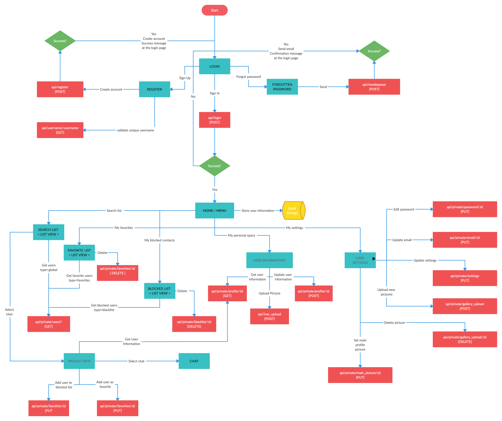

# API Development and Documentation Project

## Heartbeats App

Heartbeats is invested in creating bonding experiences for the young at heart. A bunch of team members got the idea to host a mobile app and created a app to manage the dating app and chat application

Working on this app will give you the ability to plan, architect, implement, deploy and test a real-time application - skills essential for enabling your future applications to communicate with others.

## Architecture

## About the Stack

We have chose this stack for our app.

1. Frontend - Angular 15, Ionic, Microfrontend
2. Backend - Graphql, Node, Springboot
3. Store - Mongodb, Redis cache
4. Deployments - Docker, Kubernetes, Helm, Any Cloud

It is designed with some key functional areas:

### Backend

The [backend](./backend/README.md) directory contains a partially completed API project having OpenAPI definitions for all API endpoints. It also holds generate stubs for backend DTO's and API interfaces

Graphql, Node, Springboot

> View the [Backend README](./backend/README.md) for more details.

### Frontend

Angular 15, Ionic, Microfrontend

The [frontend](./frontend/README.md) directory contains a complete Angular Ionic frontend to consume the data from the Springboot server. Read through the frontend code before starting and make notes regarding:

1. What are the end points and HTTP methods the frontend is expecting to consume?
2. How are the requests from the frontend formatted? Are they expecting certain parameters or payloads?

By making notes ahead of time, you will practice the core skill of being able to read and understand code and will have a simple plan to follow to build out the endpoints of your backend API.

> View the [Frontend README](./frontend/README.md) for more details.
